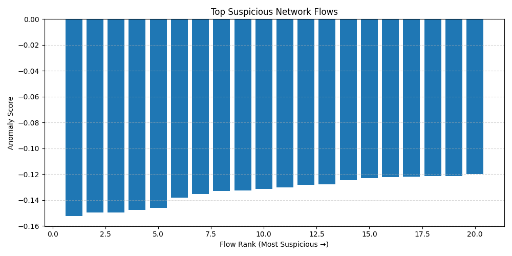
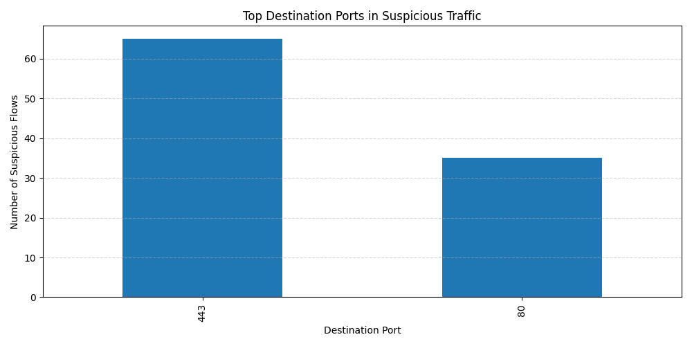

Machine learning project detecting anomalous network traffic using
Isolation Forest on the CIC-IDS2017 cybersecurity dataset.

# Network Attack Detection using Isolation Forest

Machine Learning | Cybersecurity | Network Anomaly Detection | Python

---

## Project Overview

The project simulates how security analysts surface abnormal network activity
without relying on predefined attack signatures.

Key capabilities demonstrated:

• Large-scale network flow analysis (~700k flows)  
• Isolation Forest anomaly detection  
• Feature importance analysis for network indicators  
• Visualization of suspicious traffic patterns  
• SOC-style anomaly investigation workflow

This project explores machine learning techniques for identifying suspicious
network traffic using the CIC-IDS2017 intrusion detection dataset.

The goal is to demonstrate how anomaly detection models can identify
network traffic that deviates from normal behavior and may indicate
malicious activity.

---

## Dataset

This project uses the **CIC-IDS2017 network intrusion detection dataset**, which contains labeled network traffic representing both benign activity and several types of cyber attacks.

Dataset size:
~700,000 network flow records processed using Python (pandas) ETL workflows.

The dataset includes features extracted from network flows such as:

• flow duration  
• packet count  
• byte count  
• protocol type  
• source and destination ports  

These features are used to train an **Isolation Forest anomaly detection model** that identifies unusual traffic patterns that may indicate malicious behavior.

---

## Model Evaluation

The Isolation Forest model was evaluated by comparing anomaly scores against labeled attack traffic in the CIC-IDS2017 dataset.

Evaluation metrics used:

• Precision – proportion of flagged anomalies that correspond to malicious traffic  
• Recall – ability of the model to detect known attack flows  
• False Positive Rate – benign traffic incorrectly flagged as anomalous  

These metrics help balance detection capability with operational usability for security teams, since excessive false positives can overwhelm analysts.

The goal of the model is not perfect classification but identifying unusual traffic patterns that warrant investigation in a security operations workflow.

---

## Example Visualization

Below is an example of anomaly detection results highlighting
the most suspicious network flows identified by the model.



---

## Motivation

Network security analysts must identify malicious activity within extremely
large volumes of traffic data. Traditional rule-based systems struggle to
detect novel attacks. This project explores whether anomaly detection can
surface suspicious activity without relying on predefined signatures.

---

## Technologies

- Python
- Pandas
- NumPy
- Scikit-learn
- Matplotlib
- Jupyter Notebook

---

## Detection Pipeline

CIC-IDS2017 Dataset
        ↓
Data Cleaning & Feature Selection
        ↓
Isolation Forest Model
        ↓
Anomaly Scoring
        ↓
Top Suspicious Network Flows
        ↓
Security Investigation

---

## Data Source

Canadian Institute for Cybersecurity (CIC)
CIC-IDS2017 Intrusion Detection Dataset
https://www.unb.ca/cic/datasets/ids-2017.html

---

## Dataset

CIC-IDS2017 Intrusion Detection Dataset

The CIC-IDS2017 dataset contains millions of labeled network flow records
representing both benign activity and multiple cyber attack types.

- DoS Hulk
- DoS GoldenEye
- Slowloris
- Slowhttptest
- Heartbleed

Each record represents a network flow with statistical features describing
packet counts, byte rates, durations, and connection behavior.

Dataset files are not included in this repository due to size limitations.
Download instructions are provided below.

---

## Repository Contents

attack_detection_model.ipynb – Full notebook containing data preparation,
model training, anomaly detection, and visualizations.

src/ – supporting scripts used for preprocessing and model training

outputs/ – generated anomaly detection results and visualizations

---

## Approach

The project applies an unsupervised anomaly detection approach using
Isolation Forest to identify network flows that deviate from normal behavior.

Steps performed:

1. Load and clean the network flow dataset
2. Train an Isolation Forest model on benign traffic
3. Score all flows based on anomaly likelihood
4. Identify the most suspicious network activity
5. Visualize anomalous flows and suspicious destination ports

---

## Machine Learning Method

### Isolation Forest

Isolation Forest is an unsupervised anomaly detection algorithm that
identifies outliers by randomly partitioning the feature space.

Normal observations require many partitions to isolate, while anomalies
require fewer splits and are therefore detected more quickly.

This method is well-suited for large datasets and situations where
labeled attack data may be limited.

Model configuration used in this project:

- n_estimators: 100
- contamination: 0.01
- random_state: 42

---

## Workflow

1. Data ingestion
2. Data cleaning and preprocessing
3. Feature analysis
4. Isolation Forest model training
5. Anomaly scoring
6. Visualization and investigation

---

## Key Findings

The anomaly detection model highlights flows that deviate most strongly
from normal network behavior.

Analysis of suspicious flows shows patterns consistent with attack behavior
present in the dataset, including abnormal connection durations and traffic
rates.

Port analysis helps identify the network services most associated with
suspicious activity.

---

## Evaluation

Because the model is unsupervised, anomaly scores were compared against
known attack labels within the dataset to confirm that detected flows
corresponded with malicious activity patterns.

---

Example output from the anomaly detection model:



---

## Model Output

The model flagged approximately 1% of network flows as anomalous,
aligning with the contamination parameter used during training.

---

## Operational Use Case

In a real security operations center (SOC), anomaly detection models like this are used to help analysts prioritize network activity for investigation.

Instead of relying only on known attack signatures, anomaly detection highlights traffic patterns that deviate from normal behavior. These anomalies can then be correlated with other telemetry sources such as:

• Firewall logs  
• Endpoint detection alerts  
• Authentication events  
• Threat intelligence indicators  

Security analysts can review the highest-scoring anomalies to identify:

• Port scanning activity  
• Denial-of-service traffic patterns  
• Unusual connection durations  
• Abnormal packet sizes or transfer volumes  

This approach enables earlier detection of previously unseen or evolving attack techniques that may bypass traditional rule-based detection systems.

---

## Results

The Isolation Forest model successfully surfaced network flows that deviated
significantly from normal traffic behavior.

Key observations included:

- Multiple anomalous flows associated with known attack types in the dataset
- Abnormally high connection durations and packet rates
- Concentrated suspicious activity on specific destination ports

---

## Detection Pipeline

The anomaly detection workflow processes network traffic data through several stages:

Network Flow Data  
→ Feature Engineering  
→ Isolation Forest Model  
→ Anomaly Scoring  
→ Security Analysis

This pipeline allows network traffic patterns to be analyzed for unusual behavior that may indicate malicious activity.

---

## Model Performance Summary

| Metric | Result |
|------|------|
| Dataset Size | ~700,000 network flows |
| Model | Isolation Forest |
| Anomaly Rate | 1% |
| Top Suspicious Flows Investigated | 20 |
| Detected Attack Types | DoS, Slowloris, Heartbleed |
| Key Indicators | abnormal packet rates, long durations |

---

## Model Performance

Detection performance was evaluated using labeled attack traffic in the CIC-IDS2017 dataset.

Key evaluation metrics included:

• Precision – proportion of detected anomalies that correspond to true attack traffic  
• Recall – proportion of actual attacks correctly detected by the model  

Anomaly score thresholds were analyzed to balance detection sensitivity and false positive rates when identifying suspicious network traffic.

---

## How to Run

Clone the repository:

```
git clone https://github.com/benderla/network-attack-detection
cd network-attack-detection
```

Install dependencies:

```
pip install -r requirements.txt
```

Open the notebook:

```
jupyter notebook attack_detection_model.ipynb
```

Run the notebook to reproduce the anomaly detection workflow and visualizations.

---

## Visualizations

These visualizations highlight anomalous traffic patterns identified by the Isolation Forest model.

Plots examine anomaly score distributions and network flow characteristics such as destination ports associated with suspicious traffic.  

These visualizations help validate the model's ability to surface unusual network behavior that may indicate malicious activity.

The notebook includes visualizations such as:

- Top Suspicious Network Flows
- Suspicious Destination Ports

These visualizations help analysts quickly identify unusual traffic patterns.

---

## Model Evaluation

The Isolation Forest model was evaluated against labeled attack traffic within the CIC-IDS2017 dataset.

Evaluation focused on:

- Precision and recall analysis of anomalous traffic detection
- Anomaly score distribution across network flow types
- Identification of suspicious destination ports and abnormal connection durations

These metrics helped validate that flows with the highest Isolation Forest anomaly scores aligned with known malicious traffic patterns in the CIC-IDS2017 dataset.

---

## Why This Matters

Modern networks generate massive volumes of traffic, making manual
analysis impractical.

Machine learning based anomaly detection can help security analysts
identify suspicious behavior earlier and prioritize investigations
within large network datasets.

---

## Skills Demonstrated

- Data cleaning and preprocessing
- Unsupervised machine learning
- Anomaly detection
- Exploratory data analysis
- Data visualization
- Cybersecurity data analysis

---

## Future Improvements

• Incorporate additional network metadata such as source IP reputation
• Apply graph analytics to identify suspicious communication clusters
• Deploy the model as a real-time anomaly detection pipeline
• Compare Isolation Forest with other unsupervised models (LOF, Autoencoders)

---

## Quick Start

1. Clone the repository

git clone https://github.com/benderla/network-attack-detection.git

2. Install dependencies

pip install pandas numpy scikit-learn matplotlib

3. Launch the notebook

jupyter notebook attack_detection_model.ipynb

---

## Command Line Detection

The project also includes a simple script for running anomaly detection
without using the notebook.

Run:

python src/run_detection.py

This will train the Isolation Forest model and generate a file
containing the most suspicious network flows.

Output file:

outputs/top_anomalies.csv

---

## Reproducibility

To reproduce this project:

1. Install Python 3.9+
2. Install required libraries:
   pip install pandas numpy scikit-learn matplotlib

3. Open the notebook:
   attack_detection_model.ipynb

4. Run cells sequentially to load the dataset, train the model,
   and generate anomaly detection visualizations.

---

## Sample Code

```python
from sklearn.ensemble import IsolationForest

model = IsolationForest(
    n_estimators=100,
    contamination=0.01,
    random_state=42
)

model.fit(X_train)
```

---

MIT License

---

## Author

Lee
