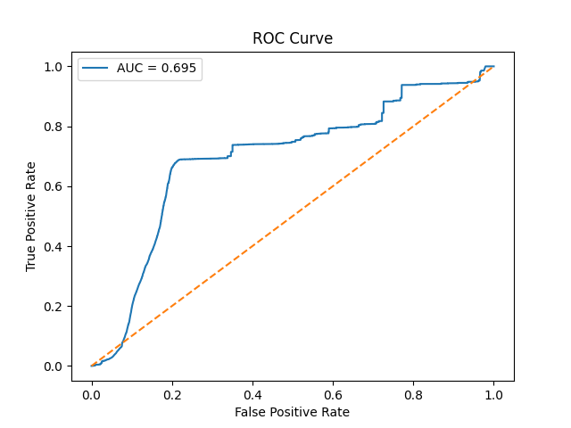
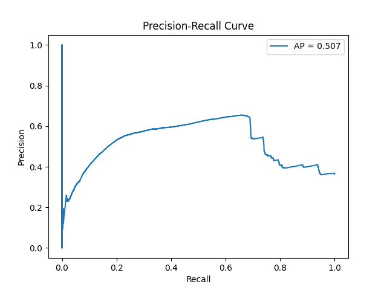
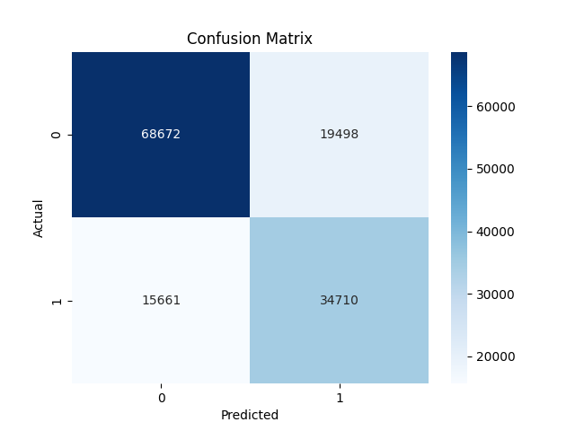
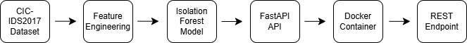

# Network Attack Detection using Isolation Forest

Anomaly detection system for identifying suspicious network traffic using the CIC-IDS2017 dataset.

This project focuses on how to build, evaluate, and operationalize an unsupervised model in a setting where labeled attack data is limited or incomplete.

---

## Overview

- Dataset: CIC-IDS2017 (~700K network flows)
- Model: Isolation Forest (unsupervised)
- Goal: Detect anomalous network behavior without relying on predefined attack signatures

This project is intentionally scoped to demonstrate:
- model selection and evaluation
- threshold tuning
- tradeoffs between precision and recall
- how anomaly detection systems behave in practice

---

## Problem

Traditional rule-based detection struggles with:
- zero-day attacks
- evolving traffic patterns
- high-volume network data

Anomaly detection provides a way to surface unusual behavior for further investigation, even when attack patterns are unknown.

---

## Dataset and Label Strategy

- Dataset contains labeled network traffic (normal + attack)
- Labels were **not used during training**
- Labels were used only for **evaluation**

Approach:
- Train model on unlabeled data
- Use anomaly scores to detect outliers
- Compare predictions against labeled data for validation

Why:
- Simulates real-world conditions where labeled attack data is limited
- Tests whether the model can generalize beyond known attack signatures

---

## Train / Validation / Test Split

- Training set:
  - Primarily normal traffic
- Validation set:
  - Mixed traffic used for threshold tuning
- Test set:
  - Held-out data used for final evaluation

Important:
- No label leakage into training
- Evaluation performed only on validation/test data

---

## Model Selection

Model used:
- Isolation Forest

Why:
- Effective for high-dimensional tabular data
- Does not require labeled anomalies
- Scales well for large datasets

Alternatives considered:
- simple statistical thresholding
- other unsupervised methods

Tradeoffs:
- Pros:
  - fast
  - scalable
- Cons:
  - sensitive to contamination parameter
  - requires threshold tuning

---

## Threshold Tuning

Isolation Forest outputs anomaly scores, not binary predictions.

Approach:
- Analyze score distribution on validation data
- Test multiple thresholds
- Select threshold based on best F1 balance

Tradeoffs:
- Lower threshold:
  - higher recall
  - more false positives
- Higher threshold:
  - higher precision
  - more missed attacks

Final threshold selected to balance detection and alert noise.

---

## Model Evaluation

| Metric     | Value |
|------------|------|
| Precision  | 0.64 |
| Recall     | 0.69 |
| F1 Score   | 0.66 |
| ROC AUC    | 0.70 |
| PR AUC     | 0.51 |

Key observations:
- Threshold tuning improved F1 from ~0.26 → 0.66
- Model captures majority of attack traffic (recall ~0.69)
- Precision-recall tradeoff allows tuning based on operational needs

---

## Baseline Comparison

To validate effectiveness, results were compared to a simple baseline.

Baseline:
- Statistical thresholding on selected features

| Method | Precision | Recall | F1 Score |
|---|---|---|---|
| Baseline (statistical) | TBD | TBD | TBD |
| Isolation Forest | 0.64 | 0.69 | 0.66 |

Observation:
- Isolation Forest provides better balance after tuning

Note:
- Baseline values are not included here and should be added in future iterations

---

## Visualizations

### ROC Curve


### Precision-Recall Curve


### Confusion Matrix


---

## Feature Importance

Key drivers of anomalous behavior:
- flow duration
- packet counts (forward/backward)
- packet length statistics
- idle time metrics

These features capture:
- scanning activity
- denial-of-service behavior
- abnormal communication bursts

---

## Architecture

### ML Pipeline


### Deployment Architecture


---

## API Inference Service

The model is exposed via FastAPI for inference.

### Run with Docker

Run from the project root where the Dockerfile is located.

```bash
docker build -t anomaly-detector .
docker run -p 8000:8000 anomaly-detector
```

### Example Request

The API expects a POST request with query parameters.

```bash
curl -X POST "http://localhost:8000/predict?duration=10000&packet_rate=50"
```

### Example Response

```json
{
  "anomaly_score": 0.1682330782229124
}
```

Note:
This endpoint currently uses POST with query parameters rather than a JSON request body.

---

## Reproducibility

To reproduce results:

```bash
pip install -r requirements.txt
jupyter notebook
```

Steps:
1. install dependencies  
2. run training and evaluation notebooks in `notebooks/`  
3. review outputs in `docs/` and `outputs/`  
4. launch API service from `api/`  

---

## Interview Questions This Project Supports

- Why did you choose Isolation Forest?  
- How do you evaluate an unsupervised model?  
- How did you choose the threshold?  
- What are the tradeoffs between precision and recall?  
- What would break this model?  
- How would you productionize this system?  